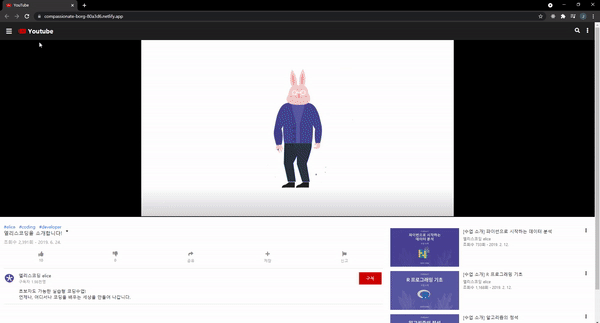
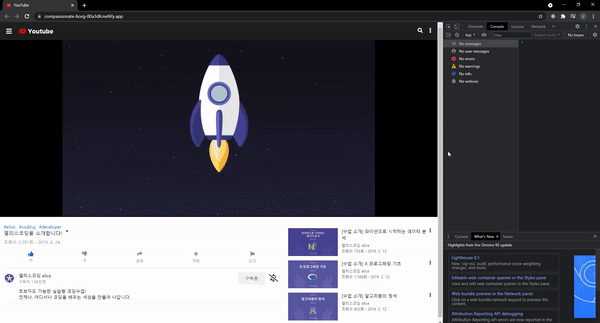

<div align="center">
  <br />
  
  <br />
  <h1>유튜브 (YouTube) with HTML&CSS</h1>
  <a href="https://app.netlify.com/sites/compassionate-borg-80a3d6/deploys">
    
  </a>
  <br />
</div>

## 목차

1. [**웹 서비스 소개**](#1)
2. [**기술 스택**](#2)
3. [**주요 페이지**](#3)
4. [**실행 방법**](#4)

<br />

<div id='1'></div>

## 💁🏻‍♂ 웹 서비스 소개

**유튜브(YouTube)** 서비스의 마크업과 스타일링만 `HTML&CSS, Vanilla JS`를 통해 클론 코딩한 웹 서비스입니다.

> 반응형 웹이 적용되어 있습니다.

<br />

[**🔗 배포된 웹 서비스로 바로가기 Click !**](https://compassionate-borg-80a3d6.netlify.app/) 👈

> 새 창 열기 방법 : CTRL+click (on Windows and Linux) | CMD+click (on MacOS)

<br />

<div id='2'></div>

## 🛠 기술 스택

**Front-end**

-   
- 

**DevOps**

-  
- 

<br />

<div id='3'></div>

## 📄 주요 페이지

|                                 일반 웹 페이지                                  |
| :-----------------------------------------------------------------------------: |
|  |

|                                  모바일 웹 페이지                                   |
| :---------------------------------------------------------------------------------: |
|  |

<br />

<div id='4'></div>

## 💻 실행 방법

1. **원격 저장소 복제**

```bash
$ git clone https://github.com/JeongHwan-dev/youtube-with-html-css.git
```

2. **프로젝트 폴더로 이동**

```bash
$ cd youtube-with-html-css
```

3. **필요한 node_modules 설치**

```bash
$ npm install
```

4. **개발 서버 실행**

```bash
$ npm run dev
```
